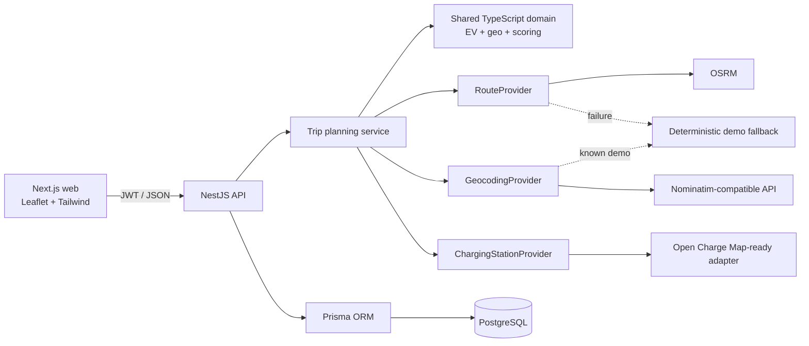

[](https://github.com/pranav7368/EV-Navigation/actions/workflows/ci.yml)

# SmartEV Navigator

SmartEV Navigator is a postgraduate full-stack project for reserve-aware EV journey planning and explainable charging-station recommendation. It calculates a road route, models battery use, filters chargers by corridor, compatibility, and reachability, then ranks the feasible choices for **FASTEST**, **CHEAPEST**, or **BALANCED** objectives.

The application deliberately uses deterministic engineering and business rules—no machine learning, generative AI, blockchain, IoT, or unnecessary services.

## Problem statement

Most station finders answer “where are chargers?” but not the more useful question: “which compatible charger can this vehicle safely reach, what should it charge to, what will that cost, and why is that stop better?” SmartEV joins route geometry, EV specifications, State of Charge (SOC), charging constraints, tariffs, and transparent scoring into one auditable plan.

## Features

- OSRM road routes behind a `RouteProvider` abstraction with a deterministic fallback.
- Geocoding behind `GeocodingProvider`, including known demo locations.
- Database/Open Charge Map-ready `ChargingStationProvider` boundary.
- Reserve-aware range, arrival SOC, target SOC, energy, time, cost, and destination SOC calculations.
- Haversine and point-to-polyline route-corridor filtering.
- Connector and AC/DC vehicle-power compatibility.
- Normalized, configuration-driven FASTEST, CHEAPEST, and BALANCED scoring.
- Deterministic natural-language recommendation reasons and ranked alternatives.
- Nearest reachable compatible-station baseline comparison.
- Interactive Leaflet/OpenStreetMap route and station map.
- JWT authentication, bcrypt hashing, validation, throttling, CORS, and admin roles.
- Persisted completed trips, stops, and recommendation audit records.
- Predictable Delhi–Jaipur academic demonstration data.

## Architecture



Controllers remain thin. `TripsService` orchestrates the central use case; pure calculations live in `@smartev/shared`; provider interfaces prevent business logic from depending on third-party response shapes.

## Technology stack

| Layer | Technology |
|---|---|
| Web | Next.js App Router, React, TypeScript, Tailwind CSS, Leaflet |
| API | NestJS, TypeScript, class-validator, Passport JWT |
| Data | PostgreSQL, Prisma ORM |
| Security | JWT, bcrypt, Helmet, CORS, throttling, role guards |
| Providers | OSRM, Nominatim-compatible geocoding, Open Charge Map-ready boundary |
| Quality | Jest, ts-jest, Playwright, ESLint, strict TypeScript |
| Local platform | pnpm workspace, Docker Compose |

## Project structure

```text
apps/
  api/                 NestJS API, Prisma schema/seed, providers, modules
  web/                 Next.js responsive product experience
packages/
  shared/              Pure EV, geospatial, and recommendation algorithms
docs/
  IMPLEMENTATION_PLAN.md
e2e/                   Playwright critical journey
docker-compose.yml     Local PostgreSQL
```

## Quick start

Requirements: Node.js 20.9+ (Node 24 is supported), pnpm 11+, and Docker Desktop.

```bash
cp .env.example .env
pnpm install
docker compose up -d postgres
pnpm db:generate
pnpm db:migrate --name init
pnpm db:seed
pnpm dev
```

Open `http://localhost:3000`; the API listens on `http://localhost:4000/api`.

Demo accounts (local seed only):

- Driver: `demo@smartev.local` / `Demo@1234`
- Admin: `admin@smartev.local` / `Demo@1234`

Change all demo credentials and `JWT_SECRET` outside local demonstrations.

## Environment variables

Copy `.env.example` to `.env`. Important variables:

| Variable | Purpose | Default/demo value |
|---|---|---|
| `DATABASE_URL` | PostgreSQL connection | Local Compose database |
| `JWT_SECRET` | API token signing | Must be replaced |
| `MIN_RESERVE_SOC` | Minimum arrival reserve | `10` |
| `DEFAULT_TARGET_SOC` | Normal charging target | `80` |
| `CHARGING_EFFICIENCY` | Grid-to-battery estimate | `0.90` |
| `MAX_STATION_CORRIDOR_KM` | Route corridor width | `10` |
| `ROUTE_ENERGY_BUFFER` | Conservative energy factor | `1.05` |
| `OSRM_BASE_URL` | Route service | Public OSRM demo server |
| `OPEN_CHARGE_MAP_API_KEY` | Backend-only provider key | Empty; optional |
| `NEXT_PUBLIC_API_URL` | Browser-visible API origin | `http://localhost:4000/api` |

Never prefix secret values with `NEXT_PUBLIC_` and never commit `.env`.

## Commands

```bash
pnpm dev              # web + API
pnpm build            # production builds
pnpm lint             # workspace lint
pnpm typecheck        # strict TypeScript
pnpm test             # Jest suites
pnpm test:e2e         # Playwright critical flow (run `pnpm dev` first)
pnpm db:generate      # generate Prisma client
pnpm db:migrate       # create/apply a development migration
pnpm db:seed          # deterministic demo data
```

### Docker

```bash
docker compose up -d postgres
docker compose ps
docker compose logs postgres
docker compose down
```

The named volume keeps database data between runs. Use `docker compose down -v` only when intentionally deleting local database data.

## Main API

All paths use the `/api` prefix. Private routes require `Authorization: Bearer <token>`.

| Method | Path | Access |
|---|---|---|
| POST | `/auth/register` | Public, rate-limited |
| POST | `/auth/login` | Public, rate-limited |
| GET | `/ev-models`, `/ev-models/:id` | Public |
| POST/GET | `/vehicles` | User |
| GET | `/stations`, `/stations/:id` | Public |
| POST | `/trips/plan` | User |
| GET | `/trips`, `/trips/:id` | User/owner |
| POST/PATCH | `/admin/*` | Admin |

Example plan request:

```json
{
  "evModelId": "<seeded-model-id>",
  "source": "New Delhi Railway Station",
  "destination": "Jaipur, Rajasthan",
  "startingSoc": 34,
  "preference": "BALANCED"
}
```

## Recommendation algorithm

1. Obtain route distance, duration, and geometry.
2. Filter stations outside the configured route corridor.
3. Remove incompatible connectors and non-operational demo chargers.
4. Calculate arrival SOC; require `arrivalSOC >= reserveSOC`.
5. Calculate target SOC: `max(80%, SOC needed for remaining route + reserve)`, capped at 100%.
6. Remove choices unable to finish the journey with reserve.
7. Calculate energy, effective power, charging-time estimate, cost, detour, and total time.
8. Min-max normalize candidate metrics to 0–1.
9. Apply configured strategy weights. Lower final score is better.
10. Compare the winner with the next-ranked choice using deterministic explanation rules.

Core formulas:

```text
efficiency = explicit override OR batteryCapacityKwh / ratedRangeKm
availableEnergy = batteryCapacityKwh × SOC / 100
estimatedRange = availableEnergy / efficiency
effectivePower = min(vehicle charging limit, charger power)
chargingEnergy = batteryCapacityKwh × (targetSOC - arrivalSOC) / 100
chargingMinutes = chargingEnergy / (effectivePower × efficiencyFactor) × 60
chargingCost = chargingEnergy × tariffPerKwh
```

## Demo journeys

1. **No charge:** India Gate → Gurugram Cyber Hub, 80% SOC.
2. **Several alternatives:** New Delhi Railway Station → Jaipur, 42% SOC.
3. **Strategy contrast:** New Delhi Railway Station → Jaipur, 34% SOC. FASTEST favors high-power DC; CHEAPEST favors the lower tariff.

Station availability and tariffs in the seed are simulated for demonstration and clearly labelled. They are not real-time claims.

## Testing

Jest covers EV efficiency/energy/range, SOC boundaries, target SOC, charging energy/time/cost, power and connector compatibility, Haversine/route-corridor utilities, normalization, strategy scoring, and trip-service integration. Playwright covers login → EV selection → trip planning → recommendation display using stable API fixtures.

## Provider configuration and resilience

- `ResilientRouteProvider` calls OSRM with an abort timeout, validates its route, and falls back to a conservative interpolated demo route.
- `ResilientGeocodingProvider` resolves known demo places locally before calling a Nominatim-compatible endpoint.
- `DatabaseChargingStationProvider` reads the curated inventory through Prisma. Its interface is the extension point for an Open Charge Map adapter.
- Browser code never receives external-provider secrets.

Public provider endpoints are suitable for low-volume academic demonstrations, not production traffic. A deployed system should use self-hosted or contracted routing/geocoding services and comply with each provider’s usage policy.

## Screenshots

Add final report captures here after running the app:

- `docs/screenshots/01-landing.png` — product framing
- `docs/screenshots/02-trip-planner.png` — primary input and map
- `docs/screenshots/03-recommendation.png` — SOC, stop, alternatives, and reason
- `docs/screenshots/04-evaluation.png` — SmartEV versus nearest baseline
- `docs/screenshots/05-admin.png` — tariff/status management

## Known limitations

- The current optimizer selects one charging stop. Long multi-stop journeys require a graph/search extension.
- Consumption is a linear academic estimate; elevation, weather, traffic, payload, battery health, and HVAC are not modeled.
- Charging time uses constant effective power and efficiency; real charging curves taper.
- Corridor distance is geometric. Exact access-road detours should be calculated with provider route legs in production.
- Seeded availability is simulated and not real time.
- Public OSRM/OpenStreetMap services have availability and fair-use constraints.

## Future scope

- Multi-stop constrained shortest-path planning.
- Provider route legs for exact station access detours.
- Time-of-day tariffs and timestamped live status from contracted feeds.
- Elevation/weather energy corrections using deterministic physical models.
- Saved preferences, vehicle-specific degradation factors, and exportable trip reports.
- Accessibility audit, localization, and production observability.

## Academic demonstration sequence

1. Show the planner and run the direct Gurugram journey.
2. Run Delhi → Jaipur at 34% with FASTEST and explain compatibility/reachability filtering.
3. Change only the preference to CHEAPEST and show the deterministic winner change.
4. Open Evaluation to compare against the nearest-station baseline.
5. Open Trip History to show persistence and Admin to show protected inventory controls.
6. Show the shared Jest tests and Prisma recommendation audit fields during the viva.

## Research basis

The implementation follows the official [Next.js App Router](https://nextjs.org/docs/app), [NestJS security guidance](https://docs.nestjs.com/security/authentication), [Prisma pnpm workspace guidance](https://www.prisma.io/docs/guides/deployment/pnpm-workspaces), [OSRM route API](https://project-osrm.org/docs/v5.24.0/api/#route-service), [Open Charge Map API project](https://openchargemap.io/site/develop/api), and [Leaflet documentation](https://leafletjs.com/reference.html).

## License

This project is available under the [MIT License](LICENSE).
